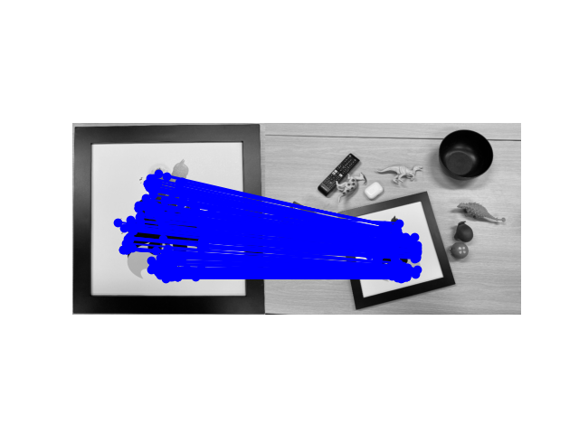
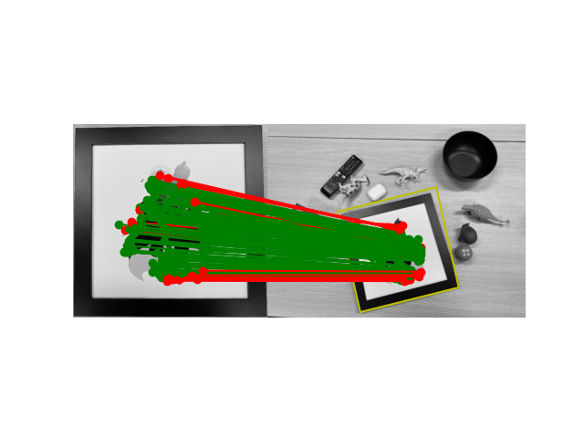
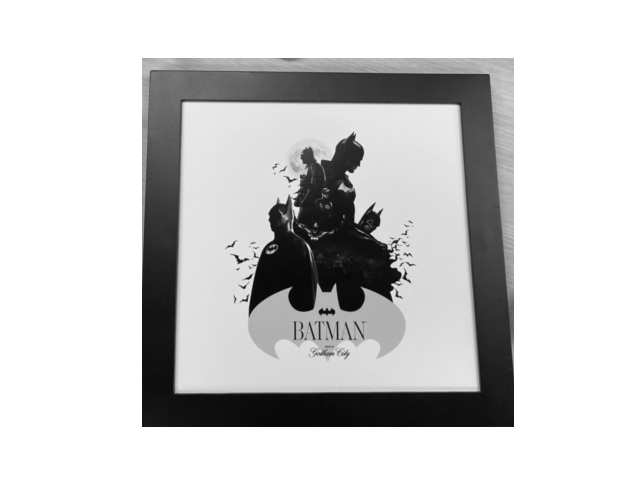
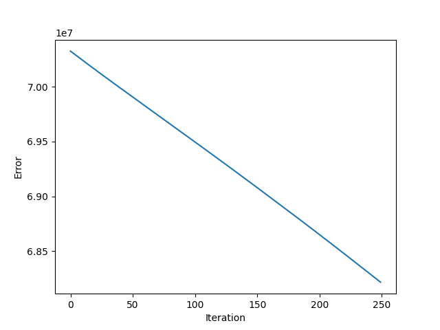
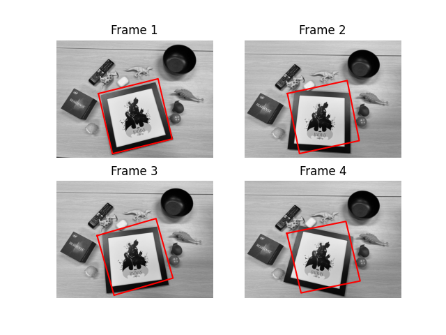

# Affine Image Registration and Tracking with SIFT & RANSAC

This project implements an end‑to‑end pipeline for registering a template image to a sequence of target frames using local features, robust affine estimation, and inverse compositional image alignment.

The core goals are:
- Match local features between a template and target image.
- Estimate a robust affine transform with RANSAC.
- Warp the target image into the template coordinate frame.
- Refine the alignment with inverse compositional image alignment.
- Track the template across multiple frames of a short sequence.

## Dependencies

This project uses standard scientific Python libraries plus OpenCV’s SIFT implementation:

- Python 3.x
- `numpy`
- `Pillow`
- `opencv-python` (for SIFT, `resize`, and `filter2D`)
- `matplotlib`
- `scikit-learn` (for `NearestNeighbors`)
- `scipy` (for `scipy.interpolate.interpn`)

You can install everything via:

```bash
pip install numpy pillow opencv-python matplotlib scikit-learn scipy
```

## Running the Demo

From inside the project directory:

```bash
python p2.py
```

The script will:

1. Load `template.jpg` and `target1.jpg`–`target4.jpg`.
2. Extract SIFT descriptors in `find_match` and visualize the matches.
3. Estimate an affine transform with RANSAC in `align_image_using_feature` and visualize inliers/outliers.
4. Warp the first target image into the template coordinate frame with `warp_image`.
5. Refine the alignment between the template and a target frame using `align_image` (inverse compositional algorithm), plotting the error curve over iterations.
6. Track the template across all target frames with `track_multi_frames` and visualize the tracking results.

If you want to save the visualizations instead of just showing them interactively, replace `plt.show()` calls in `p2.py` with `plt.savefig("results/your_filename.png")` and then close the figure.

## Example Results 

```markdown









```

## Implementation Notes

- **Feature Matching (`find_match`)**
  - Uses OpenCV’s SIFT to extract keypoints and 128‑D descriptors from both images.
  - Builds k‑nearest neighbor search structures using `NearestNeighbors` from scikit‑learn.
  - Applies the standard 0.7 ratio test to filter ambiguous matches.
  - Enforces a bidirectional consistency check (A->B and B->A) to keep only mutually‑agreed correspondences.

- **Affine Estimation with RANSAC (`align_image_using_feature`)**
  - Randomly samples 3 point correspondences per iteration (minimum for affine).
  - Solves a 6x6 linear system to recover the affine parameters for each sample.
  - Counts inliers by transforming all template points and thresholding reprojection error.
  - Keeps the affine transform with the largest inlier count over `ransac_iter` iterations.

- **Image Warping (`warp_image`)**
  - Implements inverse mapping: for each pixel in the output image, maps back to the source image via the affine transform.
  - Uses `scipy.interpolate.interpn` for bilinear interpolation on the source grid.
  - Handles out‑of‑bounds coordinates by filling with zeros.

- **Inverse Compositional Alignment (`align_image`)**
  - Parametrizes the affine transform with six parameters and follows the standard IC algorithm:
    - Precomputes spatial gradients of the template and the Jacobian of the warp.
    - Builds steepest descent images and a constant Hessian once.
    - Iteratively warps the target into the template frame, computes the error image, solves for `delta_p`, and updates the warp via composition with the inverse incremental warp.
  - Tracks the alignment error over iterations so you can verify convergence.

- **Multi‑Frame Tracking (`track_multi_frames`)**
  - Initializes the affine transform on the first target using feature‑based RANSAC.
  - Runs inverse compositional alignment for each frame in `img_list`.
  - Updates both the template (using the warped frame) and the affine transform to maintain robust tracking across the sequence.